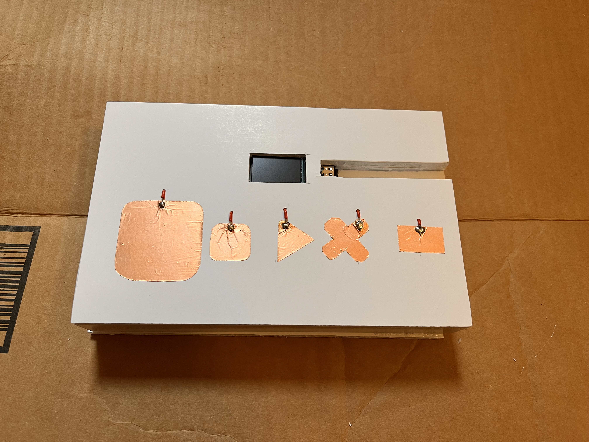

# Interactive Instrument
 

An interactive instrument that allows the user to create and save music note by note.
As the user presses the big copper pad, the computer outputs notes steadily increasing in pitch. They can stop at any point, and save the note to a sequence, playback, and erase it.
The alternate mode tests user on pitch matching abilities. It plays a note, they attempt to match it, save the note, and the device caculates the difference in hertz between what they entered and the correct value.

 

Materials: 
ESP32 with TTGO T-display 
USB-C cord with data connection 
20 inches solid core wire 
Copper tape 
Foam core 
Hot glue 
 

Code: 
Board Program (C++): mainSerial.cpp  
Computer Program (HTML): serialAudio.html  
Computer Program (Javascript): serialAudio.js  
 

Setup: 
Flash Board Program onto ESP32 
Keep ESP32 plugged in 
Open Computer Program in browser 
Connect to Board via browser 

Project Blog: https://iir47.github.io

 
 

 

